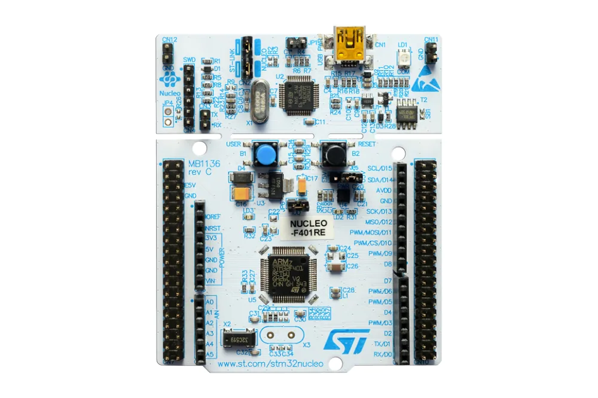
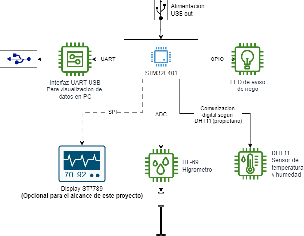
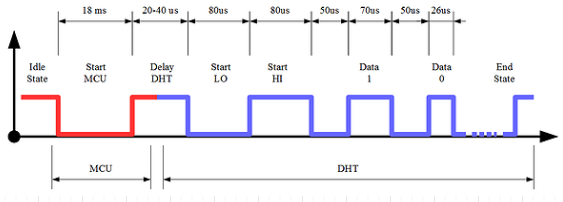
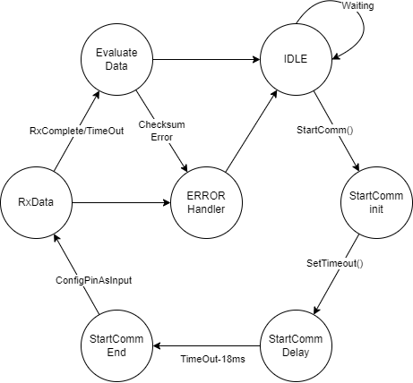

# TP Final - Protocolos de comunicación en sistemas embebidos

**Tabla de contenidos**
- [TP Final - Protocolos de comunicación en sistemas embebidos](#tp-final---protocolos-de-comunicación-en-sistemas-embebidos)
  - [Plataforma de desarrollo](#plataforma-de-desarrollo)
  - [Objetivo:](#objetivo)
  - [Ubicacion y archivos de los drivers](#ubicacion-y-archivos-de-los-drivers)
- [Idea general del proyecto](#idea-general-del-proyecto)
- [Uso de Uart driver](#uso-de-uart-driver)
  - [inicializacion](#inicializacion)
  - [Transmision por UART](#transmision-por-uart)
  - [Recepcion por UART](#recepcion-por-uart)
- [Uso de Driver DHT11](#uso-de-driver-dht11)
  - [Autor](#autor)

## Plataforma de desarrollo


Compilado y probado para la placa de desarrollo **NUCLEO-F401RE**

*STM32F401RE Embedded Nucleo STM32F4 MCU 32-Bit ARM Cortex-M3 Evaluation Board*

**NOTA:** Para esta practica, al poseer la placa un solo LED, se utilizaron las salidas **GPIO_PIN_7** y **GPIO_PIN_6** para el manejo de los 2 led restantes.

## Objetivo:
Implementar un MEF para trabajar con anti-rebotes por software. 

## Ubicacion y archivos de los drivers
```bash
├───Core
│   ├───Inc
│   ├───Src
│   └───Startup
└───Drivers
    ├───API
    │   ├───Inc     <--- API_uart.h
    │   └───Scr     <--- API_uart.c
    ├───DHT11
    │   ├───Inc     <--- API_DHT11.h
    │   ├             └-- port.h
    │   └───Scr     <--- API_DHT11.c    
    │                  └-- port.c
    ├───CMSIS
    └───STM32F4xx_HAL_Driver
```
# Idea general del proyecto

El objetivo de este proyecto es diseñar y construir un dispositivo electrónico que mida la humedad del suelo, la humedad ambiental y la temperatura ambiental para plantas de interior. Este dispositivo será una herramienta valiosa para monitorear el estado de las plantas que ayudaría a mantenerlas sanas. Además:
Reduce el desperdicio de agua.
Ahorra dinero en fertilizantes.
Facilita el cuidado de las plantas de interior.




# Uso de Uart driver

El driver consta principalmente de 3 funciones. Una de inicializacion y dos de funcionamiento continuo.

## inicializacion

```void uartInit(void)``` realiza toda la inicialización de la UART.  Ademas imprime por la terminal una serie un mensajes con sus parámetros de configuración.

La función devuelve:
true: si la inicialización es exitosa.
false: si la inicialización no es exitosa.

## Transmision por UART
```uartSendString(uint8_t *pstring)``` 

Recibe un puntero a un string que se desea enviar por la UART completo (hasta el caracter ‘\0’) y utiliza la función de la HAL ```HAL_UART_Transmit(...)``` para transmitir el string.

---

```uartSendStringSize(uint8_t * pstring, uint16_t size)``` 

Recibe un puntero a un string que se desea enviar por la UART y un entero con la cantidad de caracteres que debe enviar. La función utiliza ```HAL_UART_Transmit(...)``` para transmitir el string.

## Recepcion por UART

```void uartReceiveStringSize(uint8_t * pstring, uint16_t size)```

Recibe un puntero a un string que se desea recibir por la UART y un entero con la cantidad de caracteres que debe recibir.


# Uso de Driver DHT11

Teniendo en cuenta el diagramas de tiempos del sensor, se procedio a realizar una Maquina de estados finitos que pudiera leer al mismo sin necesidad de que el driver en si sea bloqueante.




Para lo cual se implemento un TIMER (TIMx) del STM32 para contar uS (microsegundos) en una interrupcion de flanco decendente cuando el DHT11 respondiera siguiendo la siguiente logica:




## Autor

Ing. Fernando Nicolas Calvet

@FCalvet